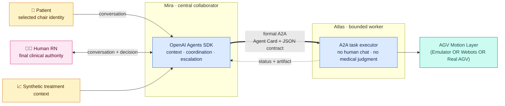
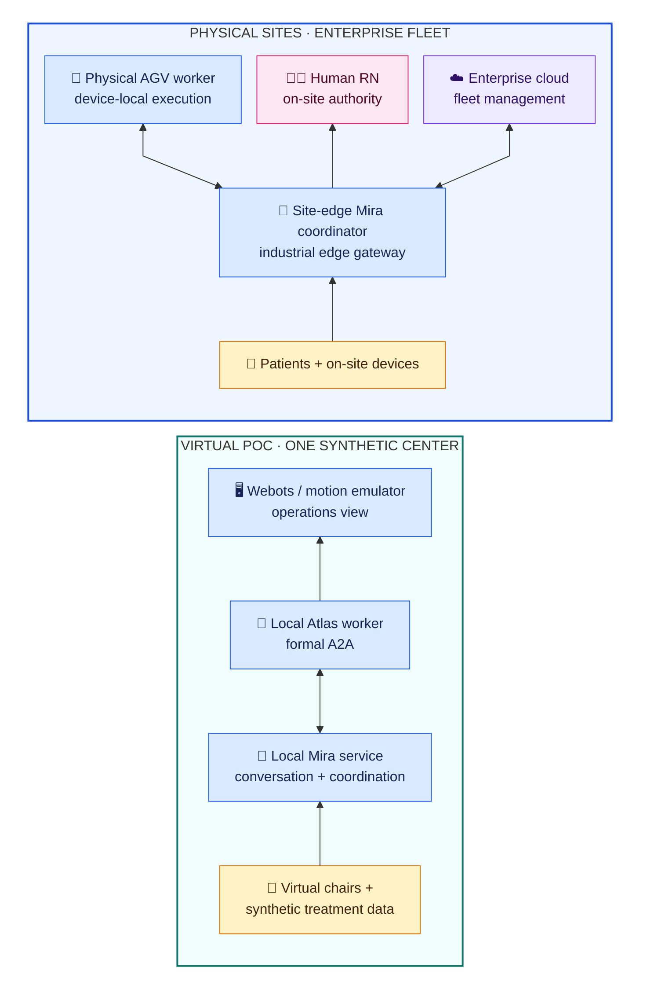

# Agentic CareLoop for In-Center Hemodialysis

A runnable, public-safe POC showing how a central AI collaborator coordinates
patients, a human RN, treatment context, and a mobile AGV worker through formal
agent-to-agent communication.

> **Interaction boundary:** Patients and the human RN talk only to **Mira**.
> **Atlas is not a chat endpoint**; it receives bounded work from Mira through
> formal A2A tasks and returns structured status and evidence.


*Real application capture—not a concept render.* Atlas performs a routine round,
Mira receives Daniel's request, formal A2A dispatches the delivery, and Atlas
resumes its round after Chair 1. [Open the static screenshot.](docs/assets/careloop-operations.jpg)

---

## System Architecture — Three Decoupled Layers

The system is intentionally split into three independent layers. Each layer can
be **replaced independently**: swap Webots for a real AGV, add ROS 2 inside the
robot, or scale to arms/legged robots — the contracts between layers remain
stable.

```
┌─────────────────────────────────────────────────────────────────────┐
│  LAYER 3 · OPERATIONS CANVAS (Web Interface)                        │
│  care-center-simulator/                                             │
│  Browser-based manager view: floor map, agent trace, chat UI        │
│  Reflects real-time state from the Agentic layer — owns no logic    │
└────────────────────────────┬────────────────────────────────────────┘
                             │  mission telemetry · A2A status
┌────────────────────────────▼────────────────────────────────────────┐
│  LAYER 2 · AGENTIC SYSTEMS                                          │
│  nurse-operator-agent/   Mira — coordinator, A2A client             │
│  aide-agv-agent/         Atlas — bounded worker, A2A server         │
│  Decision-making, care coordination, and formal task delegation      │
│  Stable A2A contract: replacing the physical layer does not touch   │
│  anything here                                                       │
└────────────────────────────┬────────────────────────────────────────┘
                             │  waypoint commands · CARELOOP_TELEMETRY
┌────────────────────────────▼────────────────────────────────────────┐
│  LAYER 1 · SIMULATION / PHYSICAL LAYER  ← swap point               │
│  physical-simulator/   Webots R2025b — differential-drive AGV       │
│  care-center-simulator/ Motion emulator (2.5D fallback / dev mode)  │
│  Digital Twin of the HD center floor: chairs, hub, AGV pose/motion  │
│  Future: replace with real AGV hardware or ROS 2 nav stack          │
└─────────────────────────────────────────────────────────────────────┘
```

### Why layers matter

| Layer | Can be replaced with | Boundary that stays stable |
|---|---|---|
| Simulation (Webots) | Real AGV hardware | `CARELOOP_TELEMETRY` JSON events + waypoint command API |
| AGV motion | ROS 2 Navigation Stack | Atlas A2A task contract (`deliver_item`, status, artifact) |
| AGV platform | Legged robot or robotic arm | Same A2A contract and telemetry schema |
| Operations Canvas | Native app, kiosk, or wall display | Mission ID correlation; no business logic in the view |

---

## The idea in 30 seconds

| Role | Product responsibility |
|---|---|
| **Mira · collaborator** | The only conversational center for patients and the RN; assembles context, coordinates work, and escalates decisions. |
| **Atlas · worker** | A mobile AGV with no general human chat; accepts bounded A2A tasks, performs visible work, and returns structured evidence. |
| **Human RN · authority** | Retains every clinical and treatment decision. Mira coordinates; it does not replace accountable judgment. |

The design intentionally does not copy a human staffing hierarchy. Mira has no
floor avatar or physical "home." Its presence is the coordination service and
right-side console. Atlas is the spatial actor, so it alone has a dock, route,
location, and movement state.

---

## What works today

- **Two identity-aware Mira conversations:** a selected fictional patient and
  Jordan Lee, RN have separate sessions and context.
- **Real coordinator → worker delegation:** Mira discovers Atlas through its
  Agent Card and sends a schema-validated A2A v1.0 JSON-RPC task.
- **Purposeful AGV behavior:** Atlas follows a clockwise routine round, diverts
  at the next safe waypoint, visits the hub for supplies or after a full round,
  and resumes from the completed task location.
- **Traceable execution:** patient message, Mira decision, A2A task, worker
  state, motion phases, artifact, and evidence reference appear in one trace.
- **Synthetic treatment context:** four fictional patients, current chair
  values, bounded profiles, and 12 weeks of compact treatment history.
- **Webots physical simulation:** a differential-drive Atlas navigates
  a synthetic four-chair room in Webots R2025b, executes the Daniel coffee
  delivery mission, and emits validated `CARELOOP_TELEMETRY` events end-to-end.

The first complete autonomous slice is intentionally narrow: **Daniel Kim's
pre-approved coffee request**. The RN can also ask Mira for a synthetic chair or
center status. Other clinical stories remain designed but are not represented
as completed runtime behavior.

---

## Layer 1 — Simulation & Digital Twin

### 2.5D Motion Emulator (browser, always available)

`care-center-simulator/` contains a built-in motion emulator that drives Atlas
through a fixed waypoint graph without Webots. It provides the Operations Canvas
with position updates and is the default development path.

### Webots Physical Simulation (local desktop, optional)

`physical-simulator/` contains the Webots world and a Python controller that
runs a real differential-drive AGV through the same mission.

| Item | Value |
|---|---|
| Simulator | Webots R2025b Nightly Build 17 Jul 2026 |
| Target hardware | Apple Silicon (M-series) |
| Robot model | Differential-drive wheeled AGV |
| World file | `physical-simulator/worlds/careloop_center.wbt` |
| Controller | `physical-simulator/controllers/atlas_controller/` |
| Telemetry output | `CARELOOP_TELEMETRY` JSON lines to stdout |
| Integration status | Daniel coffee mission runs end-to-end |

The Webots layer emits `CARELOOP_TELEMETRY` events that are structurally
identical to the motion emulator output, so the Agentic layer and Operations
Canvas cannot tell which physical backend is active. This is the designed
**swap point**: replacing Webots with a real AGV requires only a Body Adapter
that translates hardware state into the same telemetry format.

See [ADR-001](docs/decisions/ADR-001-webots-physical-simulation.md) for the
decision record.

---

## Layer 2 — Agentic Systems



The A2A contract (`deliver_item` task, status events, artifact schema) is the
**only coupling** between Layer 2 and Layer 1. A real AGV, a ROS 2 nav stack,
or a legged robot with a thin adapter exposes the same contract.

---

## Layer 3 — Operations Canvas

`care-center-simulator/` (Vite + React + TypeScript) is the manager-facing web
interface. It renders:

- **Floor map** — chair positions, Atlas location projected from telemetry
- **Agent trace** — correlated mission ID across Mira decision, A2A task, and
  Atlas motion phases
- **Chat UI** — patient and RN sessions with Mira

The Operations Canvas owns **no business logic**. It is a pure reflection of
state produced by the Agentic layer. Replacing it with a native app or a
wall-mounted kiosk requires no changes to Layers 1 or 2.

---

## One visible CareLoop

1. Daniel speaks to **Mira** from Chair 1; Atlas can be anywhere on its round.
2. Mira validates that coffee is pre-approved in this synthetic scenario.
3. Mira discovers Atlas and sends `deliver_item` through formal A2A.
4. Atlas diverts at a safe waypoint, visits the Operations Hub, and picks up the
   item.
5. The Motion Layer (emulator or Webots) drives Atlas to Chair 1.
6. Mira and the event trace retain the correlated task and evidence reference.

---

## Four-chair story map

| Chair | Fictional patient | Scenario | Runtime status |
|---|---|---|---|
| 1 | **Daniel Kim** | Stable treatment; pre-approved coffee request | **Working end to end** |
| 2 | **Noah Carter** | Anxiety and request to end treatment early | Designed; requires RN decision flow |
| 3 | **Emma Morgan** | Synthetic hypotension signal and chairside evidence | Designed; requires immediate RN alert flow |
| 4 | **Priya Shah** | Access-site soreness despite normal machine values | Designed; requires uncertainty and RN review flow |

---

## Repository layout

```text
nurse-operator-agent/     Layer 2 · Mira coordinator (Agents SDK + A2A client)
aide-agv-agent/           Layer 2 · Atlas worker (A2A server + task executor)
care-center-simulator/    Layer 3 · Operations Canvas (Vite/React UI)
                          Layer 1 · 2.5D motion emulator (dev/fallback)
physical-simulator/       Layer 1 · Webots world, controller, Body Adapter
poc-reference/            Fictional patient profiles · treatment history · story map
docs/                     PRD · technical spec · agent designs · ADRs
```

---

## Run locally

Prerequisites: Node.js, npm, and an OpenAI API key for Mira. API usage is billed
separately from ChatGPT or Codex. Atlas does not require an API key.

### Option A — Browser-only (no Webots required)

```bash
# Terminal 1 — Atlas worker (Layer 2)
cd aide-agv-agent
npm install
npm start
```

```bash
# Terminal 2 — Mira coordinator (Layer 2)
cd nurse-operator-agent
npm install
export OPENAI_API_KEY="..."
export OPENAI_MODEL="gpt-4o"
npm start
```

```bash
# Terminal 3 — Operations Canvas + motion emulator (Layer 3 + Layer 1 emulator)
cd care-center-simulator
npm install
npm run dev
```

Open `http://127.0.0.1:5173/`, select **Daniel Kim · Chair 1**, and ask:

> Hi Mira, please ask Atlas to bring me a cup of coffee.

Then switch to **RN → Mira** and request a concise synthetic Chair 1 status.

### Option B — Add Webots physical simulation (Layer 1 swap)

Install **Webots R2025b Nightly Build 17 Jul 2026** on an Apple Silicon Mac.

```bash
# Install Python dependencies for the controller
cd physical-simulator
pip install -r requirements.txt
```

Open `physical-simulator/worlds/careloop_center.wbt` in Webots and start the
simulation. Atlas executes the Daniel coffee delivery and prints
`CARELOOP_TELEMETRY` events to stdout through `completed`. Webots is fully
independent of the Operations Canvas and can be run standalone for physical
engineering work.

---

## POC today → production direction



The production direction preserves the operational contract: Mira coordinates,
Atlas works, and the human RN decides. Replacing the physical simulation with
a real AGV or a ROS 2 nav stack requires only a Body Adapter at the Layer 1
boundary.

---

## Implementation summary

| Layer | Component | Current POC choice |
|---|---|---|
| Layer 2 | Mira conversation | OpenAI Agents SDK; isolated patient and RN in-memory sessions |
| Layer 2 | Agent collaboration | Official `@a2a-js/sdk`, A2A v1.0 JSON-RPC, Agent Card discovery |
| Layer 2 | Business contracts | Provider-owned JSON Schema request and artifact contracts |
| Layer 2 | Atlas worker | Independent deterministic Node.js A2A service |
| Layer 1 | Motion emulator | Fixed waypoint graph; clockwise round; deterministic shortest task route |
| Layer 1 | Physical simulation | Webots R2025b; differential-drive AGV; Python controller |
| Layer 3 | Operations Canvas | React, TypeScript, Vite, SVG/CSS fixed-camera 2.5D view |
| — | Data | Static, fictional JSON; no database and no client data |
| — | Verification | 49 automated tests plus real-browser and Webots mission acceptance |

---

## Read next

- [POC PRD](docs/PRD.md) — product scope, personas, data, safety, and acceptance
- [Technical specification](docs/TECHNICAL_SPEC.md) — coordinator/worker runtime,
  A2A, contracts, and motion boundary
- [Mira agent](docs/MIRA_AGENT.md) and [Atlas agent](docs/ATLAS_AGENT.md) — role
  Skills, authority, and validation
- [ADR-001 Webots physical simulation](docs/decisions/ADR-001-webots-physical-simulation.md)
- [Four-patient story map](poc-reference/patient-scenarios.md) and
  [data-to-use-case map](poc-reference/use-case-catalog.md)

> All people, organizations, values, and events are fictional and synthetic.
> This is a concept demonstration—not a medical device, clinical decision
> support system, or workflow for patient care.
