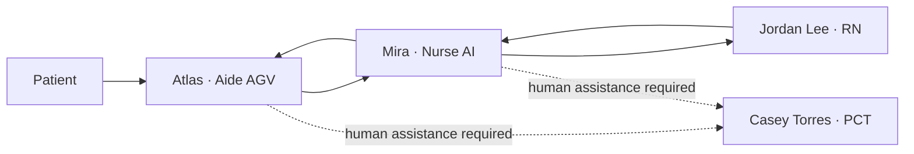
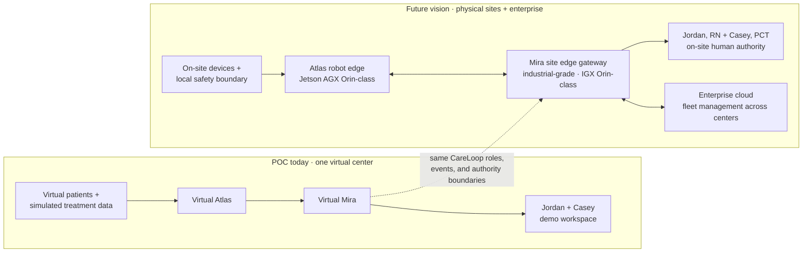

# Agentic CareLoop for In-Center Hemodialysis

> A human-in-the-loop, multi-agent simulation for a fictional in-center
> hemodialysis treatment pod.

**CareLoop Demo Center** is fully occupied: four fictional patients are in
treatment, one human RN leads clinical decisions, one human PCT remains on the
floor, and two digital employees help coordinate and support the work.

## The 30-second story

Mira, the Nurse AI, continuously combines simulated treatment data with patient
context. When information is missing, Mira dispatches Atlas, a mobile Aide AGV,
to the chair. Atlas can collect limited chairside observations, perform a
scripted manual BP/HR recheck, relay what the patient says, and complete
pre-approved support tasks.

Mira handles routine coordination. Jordan Lee, RN retains final authority over
critical and medical decisions. Casey Torres, PCT remains the human safety and
physical-assistance backstop when Atlas should not act.

The goal is not to replace clinicians. It is to show how digital workers can
absorb bounded routine work, collect better context, and make human decisions
more informed and traceable.

## Four chairs, four stories

| Chair | Patient | What happens | What it demonstrates |
|---|---|---|---|
| 1 | **Daniel Kim** | Requests his pre-approved coffee during a stable treatment | Atlas completes a routine support task without interrupting the RN |
| 2 | **Noah Carter** | Feels anxious and asks to end treatment early | Atlas relays; Mira prepares context; Jordan makes the decision |
| 3 | **Emma Morgan** | Simulated IoT BP drops to 85/48 | Mira dispatches Atlas, fuses manual recheck and symptoms, and immediately escalates to Jordan |
| 4 | **Priya Shah** | IoT values look normal, but she reports access-site soreness | Atlas observes; Mira states uncertainty; Jordan reviews the concern |

Together, these four scenarios show normal support, a patient-led medical
request, a critical data event, and a concern that only chairside observation
can reveal.

## Cast

| Person or agent | Role | Responsibility |
|---|---|---|
| **Jordan Lee, RN** | Human RN | Final clinical decision-maker and accountable supervisor |
| **Casey Torres, PCT** | Human PCT | Human safety and physical-assistance backstop |
| **Mira** | Nurse AI | Data fusion, coordination, explanation, and escalation |
| **Atlas** | Aide AGV | Chairside observation, patient communication, and bounded support work |

Patients and humans use formal names; the two digital employees use short fixed
nicknames. The interface uses simple labels such as `Emma · Chair 3` and
`Mira · Nurse AI` so the story is easy to scan.

## Planned interactive demo

The browser experience will combine a top-down treatment-floor view, live KPI
overlays, Atlas movement, a conversation/event timeline, and a prominent RN
escalation card. The demo will make the two evidence streams visible:

- **Simulated IoT data:** current treatment values and trends.
- **Chairside observation:** Atlas's manual recheck, patient report, and
  scripted physical observations.

## From virtual POC to fleet-ready vision

The POC validates the CareLoop collaboration model in a virtual center. The
future vision keeps that model, places it at the care site, and makes it
operable across a chain of centers. The primary cloud value proposition is
**fleet management at enterprise scale**—not remote clinical control.

**The simple deployment story:** Atlas acts locally at the chair; Mira
coordinates at the site; the enterprise cloud manages the fleet across many
centers. Jordan Lee, RN remains the final clinical decision-maker at the site.

## Explore the project

- [POC PRD](docs/PRD.md) — detailed product source of truth
- [Four-patient story map](poc-reference/patient-scenarios.md) — roles,
  scenarios, communication model, and Atlas task boundary
- [Synthetic clinic seed data](poc-reference/data/clinic-seed.json) — the
  fictional cast and starting treatment state

> All people, organizations, values, and events are fictional and synthetic.
> This is a concept demonstration, not a medical device or clinical
> decision-support system, and is not intended for clinical use.
