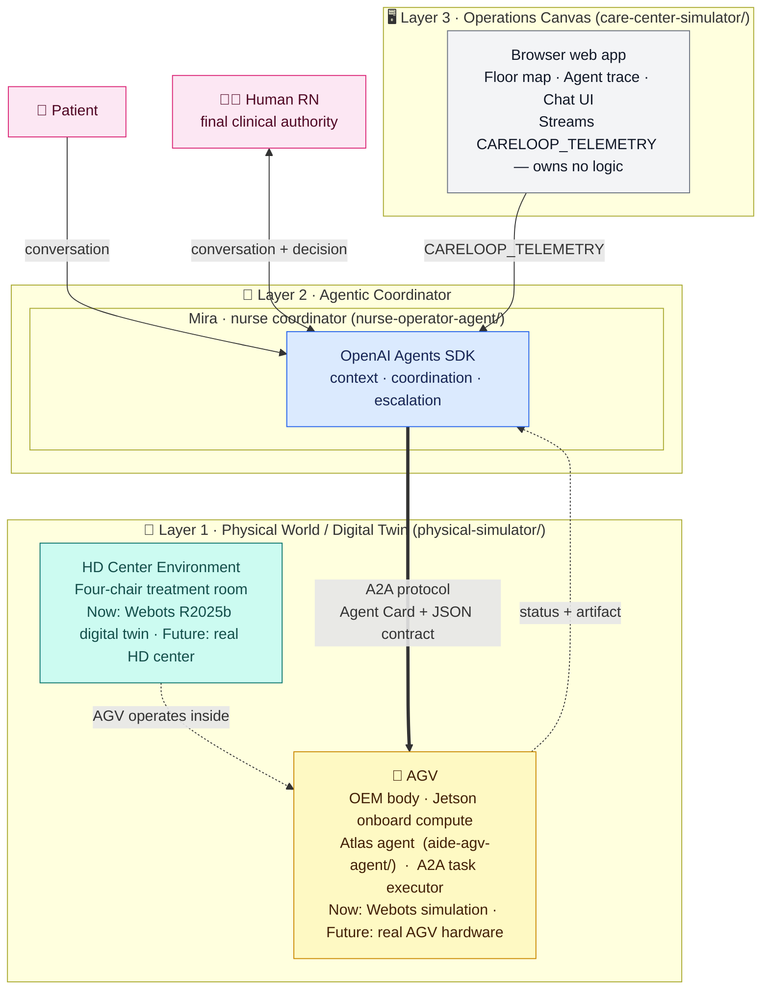

# Agentic CareLoop for In-Center Hemodialysis

A POC that wires a conversational AI coordinator, a formal agent-to-agent
protocol, and a mobile AGV worker into one traceable care loop — running in
a synthetic four-chair hemodialysis center.

> **Why this matters:** Hemodialysis centers run on repetitive, time-sensitive
> logistics while a single nurse manages four patients in parallel. This system
> explores what it looks like when AI handles coordination and a robot handles
> the physical work — while the human RN retains every clinical decision.


*Real application capture — not a concept render.* Atlas performs a routine
round, Mira receives Daniel's request, formal A2A dispatches the delivery, and
Atlas resumes its round. [Static screenshot →](docs/assets/careloop-operations.jpg)

---

## How it works — three decoupled layers



Each layer is **independently replaceable** — the contracts between them stay stable:

| Layer | Now (POC) | Future |
|---|---|---|
| **Layer 1 · HD Center** | Webots R2025b digital twin | Real hemodialysis center |
| **Layer 1 · AGV** | Webots simulation + local Atlas agent | Real OEM AGV hardware + Atlas on Jetson |
| **Layer 2 · Mira** | Local Node.js + OpenAI Agents SDK | Site-edge server or cloud |
| **Layer 3 · Operations Canvas** | React/Vite web app | Native app; wall-mounted kiosk |

The **A2A protocol** is the only interface between Mira (Layer 2) and the AGV
(Layer 1). Swapping Webots for real hardware only requires a Body Adapter that
emits the same `CARELOOP_TELEMETRY` format — nothing else changes.

---

## One complete care loop

The working end-to-end slice is **Daniel Kim's pre-approved coffee request**:

1. **Daniel** speaks to Mira from Chair 1.
2. **Mira** validates the pre-approval from his synthetic treatment context.
3. **Mira** discovers the AGV via its Agent Card and sends a `deliver_item` A2A task.
4. **Atlas** diverts from its routine patrol, visits the Operations Hub, picks up the item.
5. **The AGV** navigates to Chair 1 and completes the delivery.
6. The full trace — patient message → Mira decision → A2A task → AGV motion → artifact — is correlated by one mission ID and visible in the Operations Canvas.

---

## Patient scenarios

Four fictional patients cover the range of clinical situations a nurse faces
during a single treatment session:

| Chair | Patient | Scenario | Status |
|---|---|---|---|
| 1 | **Daniel Kim** | Stable; pre-approved coffee request | ✅ Working end to end |
| 2 | **Noah Carter** | Anxiety; wants to end treatment early | Designed — needs RN decision flow |
| 3 | **Emma Morgan** | Synthetic hypotension signal | Designed — needs immediate RN alert flow |
| 4 | **Priya Shah** | Access-site soreness; normal machine values | Designed — needs uncertainty + RN review |

---

## Technology stack

| Layer | Component | Technology |
|---|---|---|
| **Layer 1** | Physical simulation | Webots R2025b · Python controller |
| **Layer 1** | AGV agent | Node.js A2A service · deterministic task executor |
| **Layer 2** | Mira coordinator | OpenAI Agents SDK · Node.js |
| **Layer 2** | Agent communication | `@a2a-js/sdk` · A2A v1.0 JSON-RPC · Agent Card discovery |
| **Layer 3** | Operations Canvas | React · TypeScript · Vite · SVG/CSS |
| — | Data | Static fictional JSON — no database, no real patient data |
| — | Tests | 49 automated tests + Webots mission acceptance |

---

## Run it locally

**Prerequisites:** Node.js, npm, and an OpenAI API key (for Mira only).

```bash
# Terminal 1 — AGV agent (Atlas)
cd aide-agv-agent && npm install && npm start

# Terminal 2 — Mira coordinator
cd nurse-operator-agent && npm install
export OPENAI_API_KEY="sk-..."
npm start

# Terminal 3 — Operations Canvas
cd care-center-simulator && npm install && npm run dev
```

Open `http://127.0.0.1:5173/`, select **Daniel Kim · Chair 1**, and ask:

> Hi Mira, please ask Atlas to bring me a cup of coffee.

**To run the Webots physical simulation:** install Webots R2025b on Apple
Silicon, open `physical-simulator/worlds/careloop_center.wbt`, and start the
simulation. The AGV executes the same mission and emits `CARELOOP_TELEMETRY`
to stdout.

---

## Repository layout

```
nurse-operator-agent/   Layer 2 · Mira coordinator (Agents SDK + A2A client)
aide-agv-agent/         Layer 1 · Atlas AGV agent (A2A server + task executor)
care-center-simulator/  Layer 3 · Operations Canvas (React/Vite web app)
physical-simulator/     Layer 1 · Webots world, Python controller, Body Adapter
poc-reference/          Synthetic patient profiles and treatment history
docs/                   PRD, technical spec, agent designs, ADRs
```

---

## Read next

- [PRD](docs/PRD.md) — product scope, personas, safety, and acceptance criteria
- [Technical Specification](docs/TECHNICAL_SPEC.md) — A2A, contracts, motion boundary
- [ADR-001 · Why Webots](docs/decisions/ADR-001-webots-physical-simulation.md)
- [Patient story map](poc-reference/patient-scenarios.md)

---

> All patients, staff, facilities, and values are fictional and synthetic.
> This is a concept demonstration — not a medical device or clinical system.
