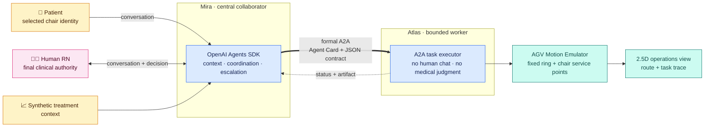
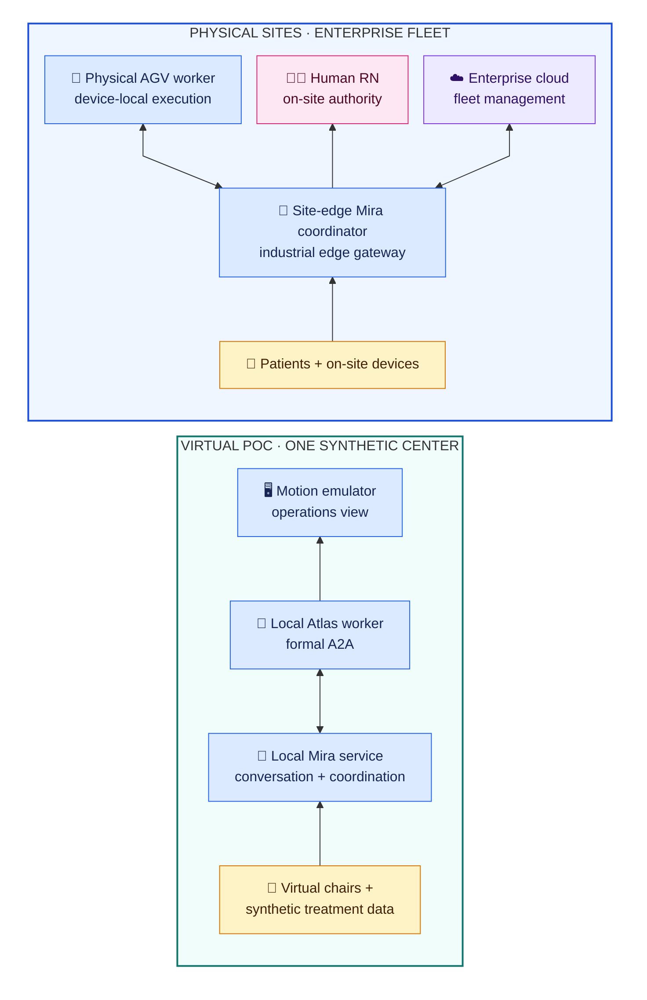

# Agentic CareLoop for In-Center Hemodialysis

A runnable, public-safe POC showing how a central AI collaborator coordinates
patients, a human RN, treatment context, and a mobile AGV worker through formal
agent-to-agent communication.

> **Interaction boundary:** Patients and the human RN talk only to **Mira**.
> **Atlas is not a chat endpoint**; it receives bounded work from Mira through
> formal A2A tasks and returns structured status and evidence.


*Real application capture—not a concept render.* Atlas performs a routine round,
Mira receives Daniel's request, formal A2A dispatches the delivery, and Atlas
resumes its round after Chair 1. [Open the static screenshot.](docs/assets/careloop-operations.jpg)

## The idea in 30 seconds

| Role | Product responsibility |
|---|---|
| **Mira · collaborator** | The only conversational center for patients and the RN; assembles context, coordinates work, and escalates decisions. |
| **Atlas · worker** | A mobile AGV with no general human chat; accepts bounded A2A tasks, performs visible work, and returns structured evidence. |
| **Human RN · authority** | Retains every clinical and treatment decision. Mira coordinates; it does not replace accountable judgment. |

The design intentionally does not copy a human staffing hierarchy. Mira has no
floor avatar or physical “home.” Its presence is the coordination service and
right-side console. Atlas is the spatial actor, so it alone has a dock, route,
location, and movement state.

## What works today

- **Two identity-aware Mira conversations:** a selected fictional patient and
  Jordan Lee, RN have separate sessions and context.
- **Real coordinator → worker delegation:** Mira discovers Atlas through its
  Agent Card and sends a schema-validated A2A v1.0 JSON-RPC task.
- **Purposeful AGV behavior:** Atlas follows a clockwise routine round, diverts
  at the next safe waypoint, visits the hub for supplies or after a full round,
  and resumes from the completed task location.
- **Traceable execution:** patient message, Mira decision, A2A task, worker
  state, motion phases, artifact, and evidence reference appear in one trace.
- **Synthetic treatment context:** four fictional patients, current chair
  values, bounded profiles, and 12 weeks of compact treatment history.

The first complete autonomous slice is intentionally narrow: **Daniel Kim's
pre-approved coffee request**. The RN can also ask Mira for a synthetic chair or
center status. Other clinical stories remain designed but are not represented
as completed runtime behavior.

## Architecture



The LLM is used where language and bounded context matter: Mira's conversations
and coordination. Atlas's current delivery execution is deterministic, so it
does not spend model tokens pretending to reason about a fixed task.

## One visible CareLoop

1. Daniel speaks to **Mira** from Chair 1; Atlas can be anywhere on its round.
2. Mira validates that coffee is pre-approved in this synthetic scenario.
3. Mira discovers Atlas and sends `deliver_item` through formal A2A.
4. Atlas diverts at a safe waypoint, visits the Operations Hub, and picks up the
   item.
5. The Motion Emulator shows delivery to Chair 1 and resumes the routine round.
6. Mira and the event trace retain the correlated task and evidence reference.

Communication and physical presence are deliberately decoupled. Conversation
is immediate; movement is required only for delivery, bounded chairside
questions, observations, or simulated measurements.

## Four-chair story map

| Chair | Fictional patient | Scenario | Runtime status |
|---|---|---|---|
| 1 | **Daniel Kim** | Stable treatment; pre-approved coffee request | **Working end to end** |
| 2 | **Noah Carter** | Anxiety and request to end treatment early | Designed; requires RN decision flow |
| 3 | **Emma Morgan** | Synthetic hypotension signal and chairside evidence | Designed; requires immediate RN alert flow |
| 4 | **Priya Shah** | Access-site soreness despite normal machine values | Designed; requires uncertainty and RN review flow |

The scenarios reuse the same patient, prescription, live-treatment, historical,
conversation, A2A, motion, and evidence boundaries. Richer stories add task
types; they do not require a new architecture.

## Implementation

| Layer | Current POC choice |
|---|---|
| Mira conversation | OpenAI Agents SDK; isolated patient and RN in-memory sessions |
| Agent collaboration | Official `@a2a-js/sdk`, A2A v1.0 JSON-RPC, Agent Card discovery |
| Business contracts | Provider-owned JSON Schema request and artifact contracts |
| Atlas worker | Independent deterministic Node.js A2A service |
| Simulation | React, TypeScript, Vite, SVG/CSS fixed-camera 2.5D view |
| Motion | Fixed waypoint graph; clockwise round; deterministic shortest task route |
| Data | Static, fictional JSON; no database and no client data |
| Verification | 39 automated tests plus real-browser conversational acceptance |

```text
nurse-operator-agent/     Mira Skill · Agents SDK runtime · A2A client
aide-agv-agent/           Atlas Skill · Agent Card · contracts · A2A worker
care-center-simulator/    synthetic floor · chat UI · motion emulator · trace
poc-reference/            fictional profiles · treatment history · story map
docs/                     PRD · technical spec · frontend and agent designs
```

## Run locally

Prerequisites: Node.js, npm, and an OpenAI API key for Mira. API usage is billed
separately from ChatGPT or Codex. Atlas does not require an API key.

```bash
# Terminal 1 — Atlas worker
cd aide-agv-agent
npm install
npm start
```

```bash
# Terminal 2 — Mira coordinator
cd nurse-operator-agent
npm install
export OPENAI_API_KEY="..."
export OPENAI_MODEL="gpt-5.6-luna"
npm start
```

```bash
# Terminal 3 — browser simulation
cd care-center-simulator
npm install
npm run dev
```

Open `http://127.0.0.1:5173/`, select **Daniel Kim · Chair 1**, and ask:

> Hi Mira, please ask Atlas to bring me a cup of coffee.

Then switch to **RN → Mira** and request a concise synthetic Chair 1 status.

## POC today → production direction



The production direction preserves the operational contract: Mira coordinates,
Atlas works, and the human RN decides. Physical navigation and safety remain
inside the future AGV boundary; enterprise cloud services manage fleets rather
than remotely controlling clinical work.

## Read next

- [POC PRD](docs/PRD.md) — product scope, personas, data, safety, and acceptance
- [Technical specification](docs/TECHNICAL_SPEC.md) — coordinator/worker runtime,
  A2A, contracts, and motion boundary
- [Mira agent](docs/MIRA_AGENT.md) and [Atlas agent](docs/ATLAS_AGENT.md) — role
  Skills, authority, and validation
- [Four-patient story map](poc-reference/patient-scenarios.md) and
  [data-to-use-case map](poc-reference/use-case-catalog.md)

> All people, organizations, values, and events are fictional and synthetic.
> This is a concept demonstration—not a medical device, clinical decision
> support system, or workflow for patient care.
