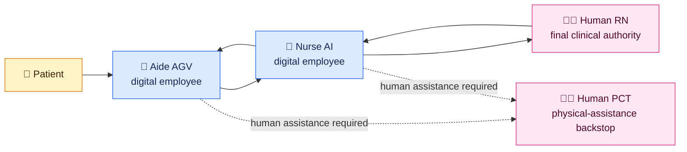
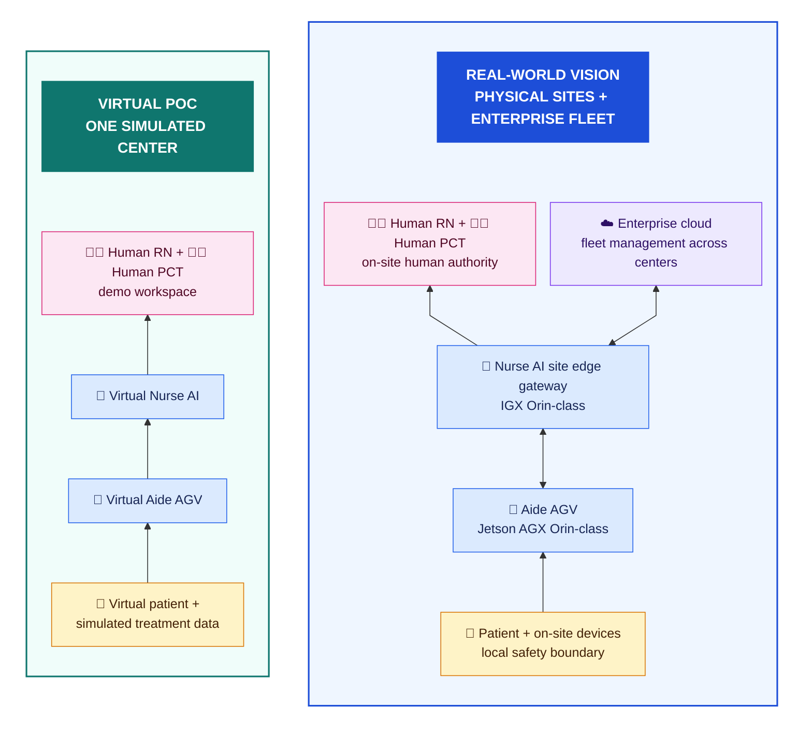

# Agentic CareLoop for In-Center Hemodialysis

> A human-in-the-loop, multi-agent simulation for a fictional in-center
> hemodialysis treatment pod.

## Run the first end-to-end journey

```bash
cd aide-agv-agent
npm install
npm start
```

In a second terminal:

```bash
cd care-center-simulator
npm install
npm run dev
```

Open `http://127.0.0.1:5173/` and select **Run Mira → Atlas**. The simulated
Mira client discovers Atlas through its Agent Card, sends Daniel's coffee task
through official A2A v1.0 JSON-RPC, validates the returned provider artifact,
and replays the verified Atlas delivery on the treatment floor. Manual movement,
delivery, patrol, stop, and reset remain available as playground controls.

See [Frontend Design](docs/FRONTEND_DESIGN.md) for the simulator layout,
deterministic routes, rendering boundary, and progressive role strategy.

See [Atlas Agent](docs/ATLAS_AGENT.md) for the first role Skill, Agent Card,
business contracts, authority boundary, and validation commands.

**CareLoop Demo Center** is fully occupied: four fictional patients are in
treatment, one human RN leads clinical decisions, one human PCT remains on the
floor, and two digital employees help coordinate and support the work.

## The 30-second story

A stationary **Nurse AI** continuously combines simulated treatment data with
patient context. When information is missing, it dispatches a mobile **Aide
AGV** to the chair. The AGV can collect limited chairside observations, perform
a scripted manual BP/HR recheck, relay what the patient says, and complete
pre-approved support tasks.

The two digital employees handle bounded observation and routine coordination.
A **human RN** retains final authority over critical and medical decisions. A
**human PCT** remains the safety and physical-assistance backstop when the AGV
should not act.



The goal is not to replace clinicians. It is to show how digital workers can
absorb bounded routine work, collect better context, and make human decisions
more informed and traceable.

## Four chairs, four stories

| Chair | Patient | What happens | What it demonstrates |
|---|---|---|---|
| 1 | **Daniel Kim** | Requests his pre-approved coffee during a stable treatment | Atlas completes a routine support task without interrupting the RN |
| 2 | **Noah Carter** | Feels anxious and asks to end treatment early | Atlas relays; Mira prepares context; Jordan makes the decision |
| 3 | **Emma Morgan** | Simulated IoT BP drops to 85/48 | Mira dispatches Atlas, fuses manual recheck and symptoms, and immediately escalates to Jordan |
| 4 | **Priya Shah** | IoT values look normal, but she reports access-site soreness | Atlas observes; Mira states uncertainty; Jordan reviews the concern |

Together, these four scenarios show normal support, a patient-led medical
request, a critical data event, and a concern that only chairside observation
can reveal.

## Cast

| Person or agent | Role | Responsibility |
|---|---|---|
| **Jordan Lee, RN** | Human RN | Final clinical decision-maker and accountable supervisor |
| **Casey Torres, PCT** | Human PCT | Human safety and physical-assistance backstop |
| **Mira** | Nurse AI | Data fusion, coordination, explanation, and escalation |
| **Atlas** | Aide AGV | Chairside observation, patient communication, and bounded support work |

Patients and humans use formal names; the two digital employees use short fixed
nicknames. The interface uses simple labels such as `Emma · Chair 3` and
`Mira · Nurse AI` so the story is easy to scan.

## Interactive demo

The current browser experience combines a fixed 2.5D treatment-floor view,
patient KPIs, routed Atlas movement, and an A2A event trace. Daniel's routine
coffee journey is operational; the RN escalation stories remain planned. The
complete demo will make two evidence streams visible:

- **Simulated IoT data:** current treatment values and trends.
- **Chairside observation:** Atlas's manual recheck, patient report, and
  scripted physical observations.

## From virtual POC to fleet-ready vision

The POC validates the CareLoop collaboration model in a virtual center. The
future vision keeps that model, places it at the care site, and makes it
operable across a chain of centers. The primary cloud value proposition is
**fleet management at enterprise scale**—not remote clinical control.



**Read bottom to top:** patient and treatment data begin at the chair; digital
employees collect and coordinate; human employees retain authority. The future
vision uses the same CareLoop model at the site, while the enterprise cloud
manages the fleet across many centers. The human RN remains the final clinical
decision-maker at the site.

## Explore the project

- [POC PRD](docs/PRD.md) — detailed product source of truth
- [Technical specification](docs/TECHNICAL_SPEC.md) — runtime, Skills,
  multi-agent contracts, state, and safety design
- [Implementation plan](docs/IMPLEMENTATION_PLAN.md) — vertical delivery slices
- [Task queue](TASKS.md) — dependency-ordered implementation checklist
- [Four-patient story map](poc-reference/patient-scenarios.md) — roles,
  scenarios, communication model, and Atlas task boundary
- [Data-to-use-case map](poc-reference/use-case-catalog.md) — how patient
  profiles, 12-week history, live data, and observations support each story
- [Synthetic clinic seed data](poc-reference/data/clinic-seed.json) — the
  fictional cast and starting treatment state

> All people, organizations, values, and events are fictional and synthetic.
> This is a concept demonstration, not a medical device or clinical
> decision-support system, and is not intended for clinical use.
