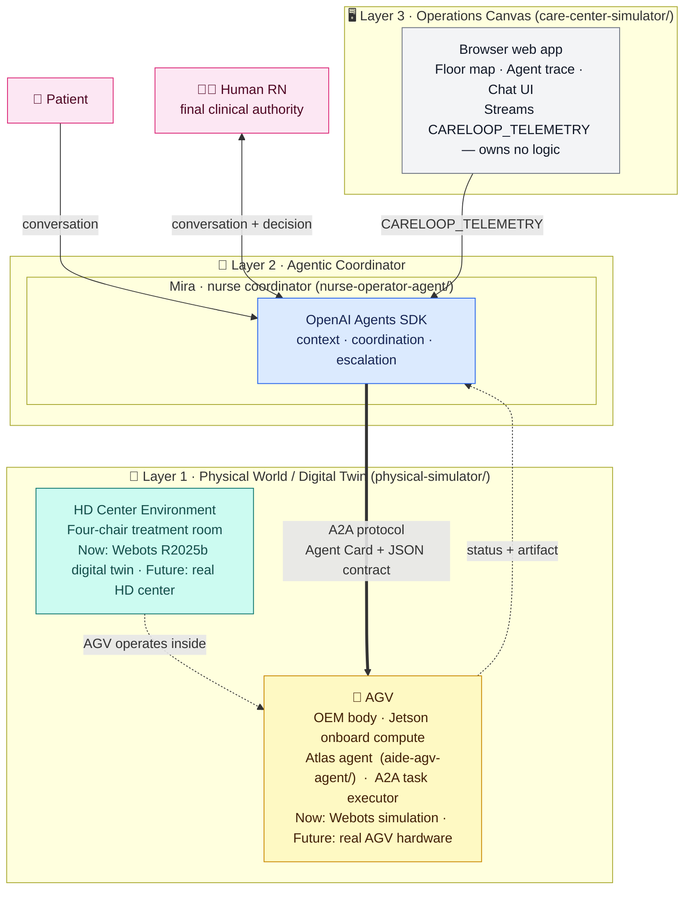
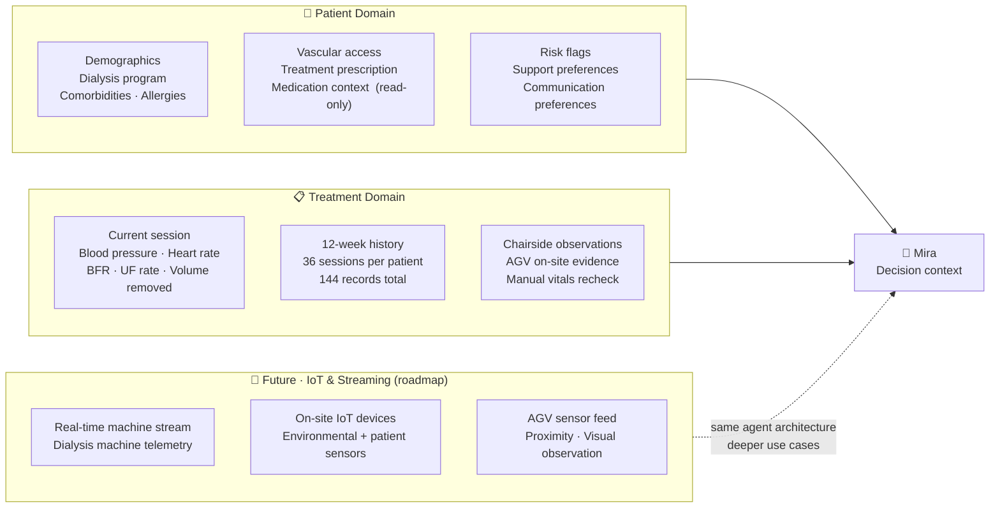

# Agentic CareLoop for In-Center Hemodialysis

A domain-specific agentic system for in-center hemodialysis operations — wiring
a conversational AI coordinator, a formal agent-to-agent protocol, and a mobile
AGV worker into one traceable care loop, driven by structured clinical data.

> **Why this matters:** Hemodialysis centers run on repetitive, time-sensitive
> logistics while a single nurse manages four patients in parallel. This system
> explores what it looks like when AI handles coordination and a robot handles
> the physical work — while the human RN retains every clinical decision.


*Real application capture — not a concept render.* Atlas performs a routine
round, Mira receives Daniel's request, formal A2A dispatches the delivery, and
Atlas resumes its round. [Static screenshot →](docs/assets/careloop-operations.jpg)

---

## Contents

1. [System Architecture](#2-system-architecture)
2. [Data Architecture](#3-data-architecture)
3. [Simulation & Digital Twin](#4-simulation--digital-twin)
4. [One Complete Care Loop](#5-one-complete-care-loop)
5. [Patient Scenarios](#6-patient-scenarios)
6. [Technology Stack](#7-technology-stack)
7. [Run It Locally](#8-run-it-locally)
8. [Repository Layout](#9-repository-layout)
9. [Read Next](#10-read-next)

---

## 2. System Architecture



Each layer is **independently replaceable** — the contracts between them stay stable:

| Layer | Now (POC) | Future |
|---|---|---|
| **Layer 1 · HD Center** | Webots R2025b digital twin | Real hemodialysis center |
| **Layer 1 · AGV** | Webots simulation + local Atlas agent | Real OEM AGV hardware + Atlas on Jetson |
| **Layer 2 · Mira** | Local Node.js + OpenAI Agents SDK | Site-edge server or cloud |
| **Layer 3 · Operations Canvas** | React/Vite web app | Native app; wall-mounted kiosk |

The **A2A protocol** is the only interface between Mira (Layer 2) and the AGV
(Layer 1). Swapping Webots for real hardware only requires a Body Adapter that
emits the same `CARELOOP_TELEMETRY` format — nothing else changes.

---

## 3. Data Architecture

This is not a toy POC. The agentic system is grounded in a structured clinical
data model that mirrors real hemodialysis operations. Every agent decision,
escalation, and AGV task is traceable back to a specific data signal.



### Patient Domain

Static clinical background that Mira loads as context for every conversation
and coordination decision:

| Data | Purpose |
|---|---|
| Demographics, dialysis program, schedule | Identifies the patient and their treatment plan |
| Primary condition, comorbidities, allergies | Gives Mira bounded clinical background |
| Vascular access type and status | Supports chairside observation tasks |
| Treatment prescription (time, BFR, DFR, UF goal, dry weight) | Grounds all treatment progress signals |
| Medication context | Read-only background — no agent may prescribe, administer, or modify orders |
| Risk flags, support preferences | Explains why a signal receives attention; enables pre-approved routines |

### Treatment Domain

Dynamic data that reflects what is happening on the floor right now and over
the past 12 weeks:

| Data | Purpose |
|---|---|
| Current session: BP, HR, BFR, UF rate, volume removed, elapsed time | Primary signals for status assessment and escalation routing |
| 12-week history (36 sessions × 4 patients = 144 records) | Longitudinal context — prior hypotension events, completion patterns, access issues |
| Session summary per patient | Compact 12-week view Mira loads without reading every record |
| Chairside observation artifact | On-site evidence collected by Atlas during a task |

### From coffee to clinical — the data roadmap

The current working use case (coffee delivery) is the simplest possible
data-driven decision: patient preference flag → pre-approval check → AGV task.

As the IoT and streaming layer is added, the same agent architecture supports
progressively deeper use cases:

| Use case | Data required |
|---|---|
| Pre-approved comfort delivery | Support preferences + current session state |
| Hypotension response | Real-time BP stream + 12-week BP history |
| Early termination request | Session progress + RN decision escalation |
| Access-site concern | AGV chairside observation + vascular access history |
| Predictive fluid management | Streaming UF rate + longitudinal weight and UF patterns |

The architecture does not change — the data depth drives the use case depth.

---

## 4. Simulation & Digital Twin

The physical layer of this system is a **self-contained digital twin** of a
four-chair in-center hemodialysis unit, built in Webots R2025b. It is not a
placeholder — it is a fully functional simulation that runs the same mission
telemetry contract the real hardware will use.

### What the simulation covers today

| Component | Implementation |
|---|---|
| HD center environment | Four-chair treatment room with Operations Hub, waypoints, and spatial layout |
| AGV platform | Differential-drive wheeled robot with fixed-waypoint navigation |
| Mission execution | Full Daniel Kim coffee delivery — divert, hub pickup, chair delivery, resume patrol |
| Telemetry output | `CARELOOP_TELEMETRY` JSON events streamed to stdout through `completed` |
| Contract validation | Schema-validated mission and telemetry contracts in `physical-simulator/contracts/` |

The Webots simulation is **independent of the Operations Canvas** — it can be
run as a standalone engineering environment without starting the web app.

### The swap principle

The `CARELOOP_TELEMETRY` event format is the only contract between Layer 1 and
Layer 2. Any physical backend that emits this format is a valid replacement:

```
Current   →  Webots R2025b digital twin
Upgrade   →  NVIDIA Omniverse / Isaac Sim  (higher fidelity, same contract)
Production →  Real OEM AGV + Jetson onboard compute  (same contract, real world)
```

This means the agentic coordinator (Mira), the AGV agent (Atlas), and the
Operations Canvas require **zero changes** when the physical layer is swapped.
The upgrade path and the production path are both well-defined from day one.

### Why Webots now

Webots was chosen as the simulation foundation because it provides real robot
physics (collision, wheel kinematics, sensor models) with an open-source
license and Apple Silicon compatibility. The current build is pinned to
**Webots R2025b Nightly Build 17 Jul 2026** for Apple Silicon.
See [ADR-001](docs/decisions/ADR-001-webots-physical-simulation.md) for the
full decision record.

---

## 5. One Complete Care Loop

The working end-to-end slice is **Daniel Kim's pre-approved coffee request**:

1. **Daniel** speaks to Mira from Chair 1.
2. **Mira** validates the pre-approval from his patient domain data.
3. **Mira** discovers the AGV via its Agent Card and sends a `deliver_item` A2A task.
4. **Atlas** diverts from its routine patrol, visits the Operations Hub, picks up the item.
5. **The AGV** navigates to Chair 1 and completes the delivery.
6. The full trace — patient message → Mira decision → A2A task → AGV motion → artifact — is correlated by one mission ID and visible in the Operations Canvas.

---

## 6. Patient Scenarios

Four fictional patients cover the range of clinical situations a nurse faces
during a single treatment session. Each scenario requires a different depth of
data and a different coordination pattern:

| Chair | Patient | Scenario | Data signals involved | Status |
|---|---|---|---|---|
| 1 | **Daniel Kim** | Stable; pre-approved coffee request | Support preferences, session state | ✅ Working end to end |
| 2 | **Noah Carter** | Anxiety; wants to end treatment early | Session progress, RN escalation | Designed — needs RN decision flow |
| 3 | **Emma Morgan** | Synthetic hypotension signal | Real-time BP, 12-week BP history | Designed — needs immediate RN alert flow |
| 4 | **Priya Shah** | Access-site soreness; normal machine values | AGV observation, vascular access history | Designed — needs uncertainty + RN review |

---

## 7. Technology Stack

| Layer | Component | Technology |
|---|---|---|
| **Layer 1** | Physical simulation | Webots R2025b · Python controller |
| **Layer 1** | AGV agent | Node.js A2A service · deterministic task executor |
| **Layer 2** | Mira coordinator | OpenAI Agents SDK · Node.js |
| **Layer 2** | Agent communication | `@a2a-js/sdk` · A2A v1.0 JSON-RPC · Agent Card discovery |
| **Layer 3** | Operations Canvas | React · TypeScript · Vite · SVG/CSS |
| — | Clinical data | Structured synthetic JSON — patient domain + treatment domain |
| — | Tests | 49 automated tests + Webots mission acceptance |

---

## 8. Run It Locally

> ⚠️ **This section is being updated.** The application architecture is
> actively evolving — the Operations Canvas and agent interfaces are being
> unified. The instructions below reflect the current state; expect a simpler
> single-command startup in a future update.

**Prerequisites:** Node.js, npm, and an OpenAI API key (for Mira only).

```bash
# Terminal 1 — AGV agent (Atlas)
cd aide-agv-agent && npm install && npm start

# Terminal 2 — Mira coordinator
cd nurse-operator-agent && npm install
export OPENAI_API_KEY="sk-..."
npm start

# Terminal 3 — Operations Canvas
cd care-center-simulator && npm install && npm run dev
```

Open `http://127.0.0.1:5173/`, select **Daniel Kim · Chair 1**, and ask:

> Hi Mira, please ask Atlas to bring me a cup of coffee.

**To run the Webots physical simulation:** install Webots R2025b on Apple
Silicon, open `physical-simulator/worlds/careloop_center.wbt`, and start the
simulation. The AGV executes the same mission and emits `CARELOOP_TELEMETRY`
to stdout.

---

## 9. Repository Layout

```
nurse-operator-agent/   Layer 2 · Mira coordinator (Agents SDK + A2A client)
aide-agv-agent/         Layer 1 · Atlas AGV agent (A2A server + task executor)
                        Stable protocol layer — survives hardware swap
care-center-simulator/  Layer 3 · Operations Canvas (React/Vite web app)
physical-simulator/     Layer 1 · Webots world, Python controller, Body Adapter
                        Replaceable physical layer — swap for real AGV hardware
poc-reference/          Clinical data model: patient domain + treatment domain
docs/                   PRD, technical spec, agent designs, ADRs
```

---

## 10. Read Next

- [PRD](docs/PRD.md) — product scope, personas, safety, and acceptance criteria
- [Technical Specification](docs/TECHNICAL_SPEC.md) — A2A, contracts, motion boundary
- [Data Model](poc-reference/data-model.md) — field-level decisions and exclusions
- [ADR-001 · Why Webots](docs/decisions/ADR-001-webots-physical-simulation.md)
- [Patient story map](poc-reference/patient-scenarios.md)

---

> All patients, staff, facilities, and values are fictional and synthetic.
> This is a concept demonstration — not a medical device or clinical system.
