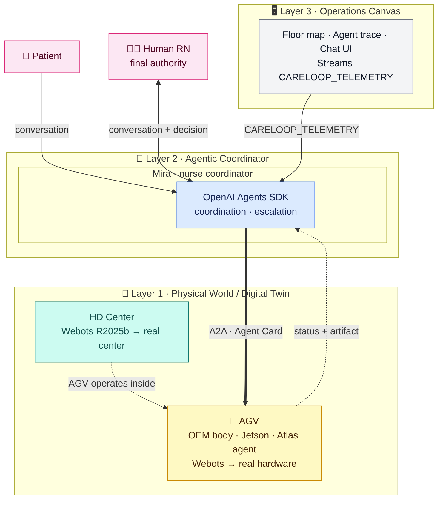
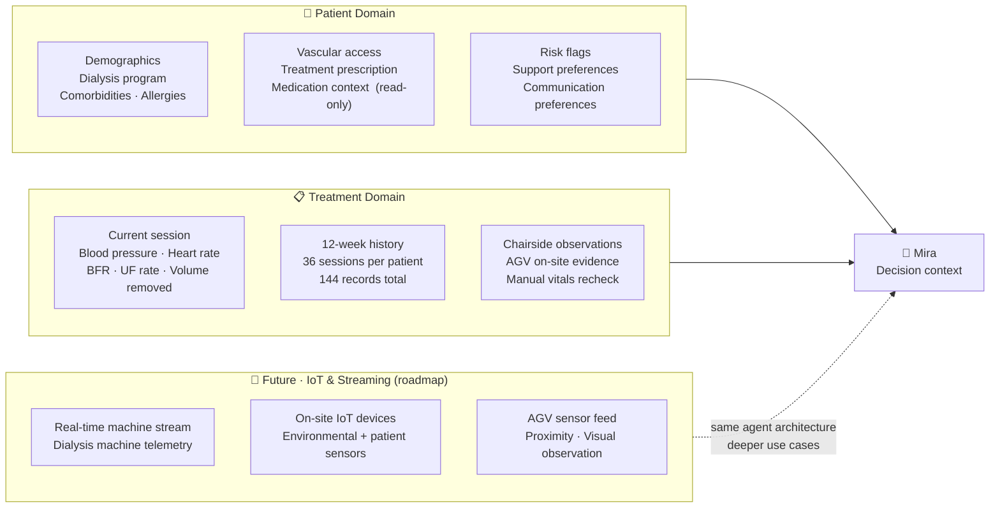
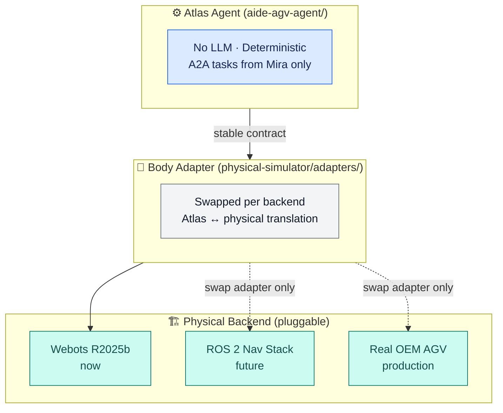
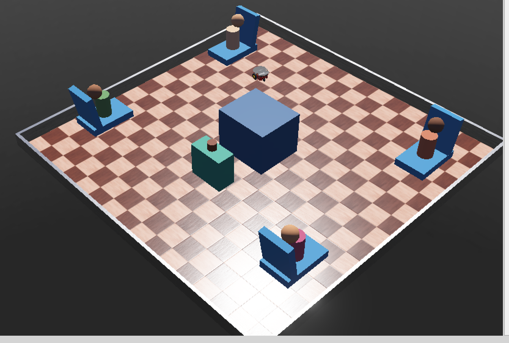

# Agentic CareLoop for In-Center Hemodialysis

**CareLoop** is a full-stack physical AI system built for in-center hemodialysis operations — demonstrating how an AI coordinator, a formal agent protocol, and a mobile robot work together in a real clinical domain.

- **Domain** — A hemodialysis center runs four patients in parallel under a single nurse, with time-sensitive logistics repeating every session. This system explores AI-assisted coordination and robotic execution while keeping the human RN as the final clinical authority.

- **Architecture** — Three independent layers: a Webots digital twin (simulation → real AGV hardware), an agentic tier with Mira as coordinator and Atlas as AGV worker connected via A2A protocol, and an Operations Canvas for real-time management visibility. Every layer is replaceable without touching the others.

- **Data** — Grounded in structured clinical data: patient domain (prescriptions, comorbidities, medications) and treatment domain (live session signals, 12-week history). Designed to support progressively deeper use cases as IoT and streaming data are added.

- **Scalability** — From one AGV in one center today, to a fleet of agents across multiple sites — same architecture, deeper data, more complex scenarios.

---

## Contents

1. [System Architecture](#2-system-architecture)
2. [Data Architecture](#3-data-architecture)
3. [Simulation & Digital Twin](#4-simulation--digital-twin)
4. [Clinical Scenarios](#5-clinical-scenarios)
5. [Technology Stack](#6-technology-stack)
6. [Run It Locally](#7-run-it-locally)
7. [Repository Layout](#8-repository-layout)
8. [Read Next](#9-read-next)

---

## 2. System Architecture



Each layer is **independently replaceable** — the contracts between them stay stable:

| Layer | Now (POC) | Future |
|---|---|---|
| **Layer 1 · HD Center** | Webots R2025b digital twin | Real hemodialysis center |
| **Layer 1 · AGV** | Webots simulation + local Atlas agent | Real OEM AGV hardware + Atlas on Jetson |
| **Layer 2 · Mira** | Local Node.js + OpenAI Agents SDK | Site-edge server or cloud |
| **Layer 3 · Operations Canvas** | React/Vite web app | Native app; wall-mounted kiosk |

The **A2A protocol** is the only interface between Mira (Layer 2) and the AGV
(Layer 1). Swapping Webots for real hardware only requires a Body Adapter that
emits the same `CARELOOP_TELEMETRY` format — nothing else changes.

---

## 3. Data Architecture

This is not a toy POC. The agentic system is grounded in a structured clinical
data model that mirrors real hemodialysis operations. Every agent decision,
escalation, and AGV task is traceable back to a specific data signal.



### Patient Domain

Static clinical background that Mira loads as context for every conversation
and coordination decision:

| Data | Purpose |
|---|---|
| Demographics, dialysis program, schedule | Identifies the patient and their treatment plan |
| Primary condition, comorbidities, allergies | Gives Mira bounded clinical background |
| Vascular access type and status | Supports chairside observation tasks |
| Treatment prescription (time, BFR, DFR, UF goal, dry weight) | Grounds all treatment progress signals |
| Medication context | Read-only background — no agent may prescribe, administer, or modify orders |
| Risk flags, support preferences | Explains why a signal receives attention; enables pre-approved routines |

### Treatment Domain

Dynamic data that reflects what is happening on the floor right now and over
the past 12 weeks:

| Data | Purpose |
|---|---|
| Current session: BP, HR, BFR, UF rate, volume removed, elapsed time | Primary signals for status assessment and escalation routing |
| 12-week history (36 sessions × 4 patients = 144 records) | Longitudinal context — prior hypotension events, completion patterns, access issues |
| Session summary per patient | Compact 12-week view Mira loads without reading every record |
| Chairside observation artifact | On-site evidence collected by Atlas during a task |

### From coffee to clinical — the data roadmap

The current working use case (coffee delivery) is the simplest possible
data-driven decision: patient preference flag → pre-approval check → AGV task.

As the IoT and streaming layer is added, the same agent architecture supports
progressively deeper use cases:

| Use case | Data required |
|---|---|
| Pre-approved comfort delivery | Support preferences + current session state |
| Hypotension response | Real-time BP stream + 12-week BP history |
| Early termination request | Session progress + RN decision escalation |
| Access-site concern | AGV chairside observation + vascular access history |
| Predictive fluid management | Streaming UF rate + longitudinal weight and UF patterns |

The architecture does not change — the data depth drives the use case depth.

---

## 4. Simulation & Digital Twin

### Design principle — Ports and Adapters

The AGV layer uses a **Ports and Adapters** pattern (Hexagonal Architecture).
Atlas Agent is self-contained and independent — it has no knowledge of the
physical world below it. The Body Adapter is the only component that changes
when the physical backend is swapped.



**Atlas Agent does not require a large language model.** Task logic is fully
deterministic — no API key, no inference cost, no latency. LLMs are used only
where language understanding is genuinely needed (Mira). This is an
intentional design choice.

### What the simulation covers today

| Component | Implementation |
|---|---|
| HD center environment | Four-chair treatment room with Operations Hub, waypoints, and spatial layout |
| AGV platform | Differential-drive wheeled robot with fixed-waypoint navigation |
| Mission execution | Full Daniel Kim coffee delivery — divert, hub pickup, chair delivery, resume patrol |
| Telemetry output | `CARELOOP_TELEMETRY` JSON events through `completed` |
| Contract validation | Schema-validated mission and telemetry contracts in `physical-simulator/contracts/` |
| Body Adapter | `physical-simulator/adapters/body_contract.py` — bridges Atlas Agent to Webots |

The Webots simulation runs as a **standalone engineering environment**,
independent of the Operations Canvas.

### The plug-in roadmap

When the physical backend changes, only the Body Adapter is rewritten:

| Backend | What changes | What stays the same |
|---|---|---|
| Webots → ROS 2 | Body Adapter for ROS topics/services | Atlas Agent, Mira, Canvas, all contracts |
| Webots → Omniverse / Isaac Sim | Body Adapter for Omniverse API | Atlas Agent, Mira, Canvas, all contracts |
| Webots → Real AGV + Jetson | Body Adapter as hardware driver; Atlas Agent deployed on Jetson | Mira, Canvas, A2A contract, telemetry schema |

This means the upgrade path and the production path are both well-defined
from day one — no architectural rework required.

### Why Webots now

Webots provides real robot physics (collision, wheel kinematics, sensor models)
with an open-source license and Apple Silicon compatibility. Pinned to
**Webots R2025b Nightly Build 17 Jul 2026**.
See [ADR-001](docs/decisions/ADR-001-webots-physical-simulation.md).

---

## 5. Clinical Scenarios

Four fictional patients cover the spectrum of situations a nurse faces in a
single treatment session — from routine logistics to urgent clinical escalation.
Each scenario requires a different data depth and a different coordination
pattern, demonstrating how the same architecture supports progressively complex
use cases.

| Chair | Patient | Scenario | Data signals | Status |
|---|---|---|---|---|
| 1 | **Daniel Kim** | Pre-approved comfort delivery | Support preferences · session state | ✅ End to end |
| 2 | **Noah Carter** | Anxiety · wants to end treatment early | Session progress · RN escalation | Designed |
| 3 | **Emma Morgan** | Hypotension signal during treatment | Real-time BP · 12-week BP history | Designed |
| 4 | **Priya Shah** | Access-site soreness · normal machine values | AGV observation · vascular access history | Designed |

Chair 1 is the current working slice — patient conversation → Mira decision →
A2A task → AGV delivery → mission trace in the Canvas, all correlated by one
mission ID.

---

## 6. Technology Stack

The language strategy is deliberately simple: **Python for all server-side
logic, JavaScript/TypeScript only for the browser Canvas.** This keeps the
backend stack unified and avoids context-switching between languages.

| Layer | Component | Technology |
|---|---|---|
| **Layer 1** | Physical simulation | Webots R2025b · Python controller |
| **Layer 1** | AGV agent | Python · A2A server · deterministic task executor |
| **Layer 1** | Body Adapter | Python · bridges Atlas Agent to physical backend |
| **Layer 2** | Mira coordinator | Python · OpenAI Agents SDK |
| **Layer 2** | Agent communication | A2A v1.0 JSON-RPC · Agent Card discovery |
| **Layer 3** | Operations Canvas | React · TypeScript · Vite · SVG/CSS |
| — | Clinical data | Structured synthetic JSON — patient domain + treatment domain |
| — | Tests | Automated test suite + Webots mission acceptance |

---

## 7. Run It Locally

**Design target:** starting the Canvas starts the entire system. Three services
run locally, each on its own port. The Canvas is the only external entry point
— everything else is internal.

```bash
export OPENAI_API_KEY="sk-..."
npm install && npm start
```

Open `http://127.0.0.1:5173/`

**What starts automatically:**

- **Operations Canvas** · `localhost:5173` · React/Vite web app
  - The single external entry point — open this in a browser, nothing else
  - Patient conversation panel and nurse conversation panel are both embedded here
  - Streams floor map, agent trace, and mission telemetry in real time

- **Mira · nurse coordinator** · `localhost:3000` (internal)
  - Starts automatically with the Canvas
  - Powers both conversation panels via the OpenAI Agents SDK
  - Dispatches A2A tasks to Atlas; requires `OPENAI_API_KEY`
  - Integrated with Canvas — not a separate UI

- **Atlas · AGV agent** · `localhost:4000` (internal)
  - Starts automatically with the Canvas
  - Python A2A server — no LLM, no API key, no external interface
  - Invisible from outside: only Mira sends tasks to it
  - Receives `deliver_item` tasks; emits `CARELOOP_TELEMETRY` back to Mira and Canvas

**To add Webots physical simulation** (optional engineering layer): install
Webots R2025b on Apple Silicon and open
`physical-simulator/worlds/careloop_center.wbt`. The Body Adapter connects
Webots to Atlas Agent via the `CARELOOP_TELEMETRY` contract — no other
configuration needed.

> **Implementation note:** Single-command startup and automatic service launch
> are the baseline design. Active implementation is in progress.

---

### What you should see — two windows, two perspectives

Running the full system opens two simultaneous views that together demonstrate
the complete architecture:

**Window 1 · Operations Canvas** `http://127.0.0.1:5173/`
*(Layer 3 — for the center manager and the interviewer)*


The browser dashboard shows the floor from a management perspective: chair
status, Atlas position projected from telemetry, patient and nurse conversation
panels, and a correlated mission trace. This is what a center manager sees —
business-level visibility with no awareness of the physical simulation running
below it.

**Window 2 · Webots Digital Twin** *(desktop application)*
*(Layer 1 — for the engineer and developer)*



The Webots window shows the physical world: the actual room geometry, the
differential-drive AGV moving through waypoints, wheel motion, and spatial
position. This is what the engineer sees — the physical reality that the
Operations Canvas reflects as abstracted telemetry.

**Together, these two windows make the layer separation tangible:**
the same coffee delivery mission appears as a business event in the Canvas
and as physical robot movement in Webots — connected by nothing more than the
`CARELOOP_TELEMETRY` contract.

---

## 8. Repository Layout

```
nurse-operator-agent/     Layer 2 · Mira coordinator (Agents SDK + A2A client)

aide-agv-agent/           Layer 1 · Atlas AGV agent — self-contained, no LLM
                          A2A server · deterministic task logic · Body Adapter port
                          Stable across all physical backends

physical-simulator/       Layer 1 · Physical backend (currently Webots)
  adapters/               Body Adapter — the only component swapped per backend
  controllers/            Webots robot controller (wheels, navigation, physics)
  contracts/              Mission and telemetry schema validation
  worlds/                 Webots four-chair HD center world

care-center-simulator/    Layer 3 · Operations Canvas (React/Vite web app)

poc-reference/            Clinical data model: patient domain + treatment domain
docs/                     PRD, technical spec, agent designs, ADRs
```

---

## 9. Read Next

- [PRD](docs/PRD.md) — product scope, personas, safety, and acceptance criteria
- [Technical Specification](docs/TECHNICAL_SPEC.md) — A2A, contracts, motion boundary
- [Data Model](poc-reference/data-model.md) — field-level decisions and exclusions
- [ADR-001 · Why Webots](docs/decisions/ADR-001-webots-physical-simulation.md)
- [Patient story map](poc-reference/patient-scenarios.md)

---

> All patients, staff, facilities, and values are fictional and synthetic.
> This is a concept demonstration — not a medical device or clinical system.
