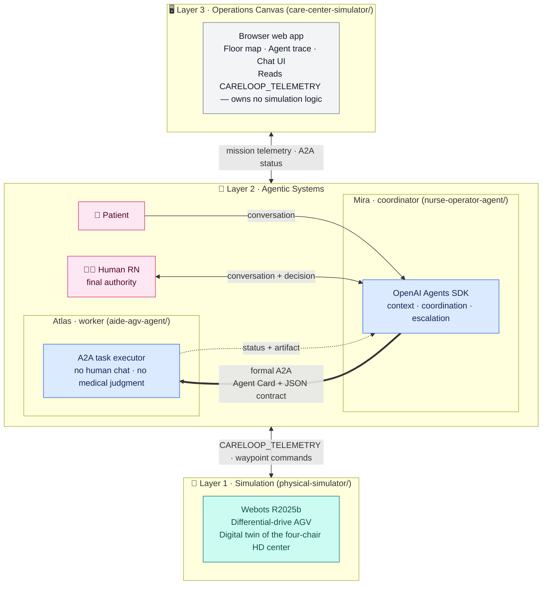

# Agentic CareLoop for In-Center Hemodialysis

A POC that wires a conversational AI coordinator, a formal agent-to-agent
protocol, and a mobile AGV worker into one traceable care loop — running in
a synthetic four-chair hemodialysis center.

> **Why this matters:** Hemodialysis centers run on repetitive, time-sensitive
> logistics while a single nurse manages four patients in parallel. This system
> explores what it looks like when AI handles coordination and a robot handles
> the physical work — while the human RN retains every clinical decision.


*Real application capture — not a concept render.* Atlas performs a routine
round, Mira receives Daniel's request, formal A2A dispatches the delivery, and
Atlas resumes its round. [Static screenshot →](docs/assets/careloop-operations.jpg)

---

## How it works — three decoupled layers



Each layer is **independently replaceable** — the contracts between them stay stable:

| Layer | Target design | Future direction |
|---|---|---|
| **Layer 1 · Simulation** | Webots R2025b — digital twin of the HD center floor | Replace with real AGV hardware; add ROS 2 nav stack; swap to legged robots or arms |
| **Layer 2 · Agentic Systems** | Local Mira + Atlas services (Node.js + OpenAI Agents SDK) | Site-edge deployment; enterprise fleet management |
| **Layer 3 · Operations Canvas** | React/Vite web app streaming `CARELOOP_TELEMETRY` | Native app; wall-mounted kiosk; clinical dashboard |

The **only coupling** between Layer 1 and Layer 2 is the `CARELOOP_TELEMETRY`
JSON event stream. Swapping the simulation for real hardware requires only a
thin Body Adapter that emits the same telemetry format — nothing else changes.

---

## The cast

| | Role | What they do | What they don't do |
|---|---|---|---|
| **Mira** | AI coordinator | Converses with patients and the RN; assembles treatment context; delegates physical tasks via A2A | Make clinical decisions; physically move |
| **Atlas** | AGV worker | Accepts bounded A2A tasks; patrols the floor; delivers items; returns structured evidence | Chat with humans; make medical judgments |
| **Human RN** | Final authority | Owns every clinical and treatment decision | — |

---

## What runs today

The working end-to-end slice is Daniel Kim's pre-approved coffee request:

1. **Daniel** speaks to Mira from Chair 1.
2. **Mira** validates the pre-approval from synthetic treatment context.
3. **Mira** discovers Atlas via its Agent Card and sends a `deliver_item` A2A task.
4. **Atlas** diverts from its routine round, visits the Operations Hub, picks up the item.
5. **The simulation layer** (Webots or browser emulator) drives Atlas to Chair 1.
6. The full trace — patient message → Mira decision → A2A task → Atlas motion → artifact — is correlated by one mission ID and visible in the Operations Canvas.

### Four-chair story map

| Chair | Patient | Scenario | Status |
|---|---|---|---|
| 1 | **Daniel Kim** | Stable; pre-approved coffee request | ✅ Working end to end |
| 2 | **Noah Carter** | Anxiety; wants to end treatment early | Designed — needs RN decision flow |
| 3 | **Emma Morgan** | Synthetic hypotension signal | Designed — needs immediate RN alert flow |
| 4 | **Priya Shah** | Access-site soreness; normal machine values | Designed — needs uncertainty + RN review |

---

## Stack

| Component | Technology |
|---|---|
| Mira coordinator | OpenAI Agents SDK · Node.js |
| Agent communication | `@a2a-js/sdk` · A2A v1.0 JSON-RPC · Agent Card discovery |
| Atlas worker | Deterministic Node.js A2A service |
| Operations Canvas | React · TypeScript · Vite · SVG/CSS |
| Physical simulation | Webots R2025b · Python controller |
| Data | Static fictional JSON — no database, no real patient data |
| Tests | 49 automated tests + Webots mission acceptance |

---

## Run it locally

**Prerequisites:** Node.js, npm, and an OpenAI API key (for Mira only).

```bash
# Terminal 1 — Atlas worker
cd aide-agv-agent && npm install && npm start

# Terminal 2 — Mira coordinator
cd nurse-operator-agent && npm install
export OPENAI_API_KEY="sk-..."
npm start

# Terminal 3 — Operations Canvas (includes browser motion emulator)
cd care-center-simulator && npm install && npm run dev
```

Open `http://127.0.0.1:5173/`, select **Daniel Kim · Chair 1**, and ask:

> Hi Mira, please ask Atlas to bring me a cup of coffee.

**To add Webots physical simulation** (optional): install Webots R2025b on
Apple Silicon, then open `physical-simulator/worlds/careloop_center.wbt` and
start the simulation. Atlas executes the same mission and emits
`CARELOOP_TELEMETRY` to stdout. The Operations Canvas works with or without it.

---

## Repository layout

```
nurse-operator-agent/   Mira — coordinator, A2A client
aide-agv-agent/         Atlas — A2A worker, task executor
care-center-simulator/  Operations Canvas (web UI) + motion emulator
physical-simulator/     Webots world, Python controller, Body Adapter
poc-reference/          Synthetic patient profiles and treatment history
docs/                   PRD, technical spec, agent designs, ADRs
```

---

## Read next

- [PRD](docs/PRD.md) — product scope, personas, safety, and acceptance criteria
- [Technical Specification](docs/TECHNICAL_SPEC.md) — A2A, contracts, motion boundary
- [ADR-001 · Why Webots](docs/decisions/ADR-001-webots-physical-simulation.md)
- [Patient story map](poc-reference/patient-scenarios.md)

---

> All patients, staff, facilities, and values are fictional and synthetic.
> This is a concept demonstration — not a medical device or clinical system.
